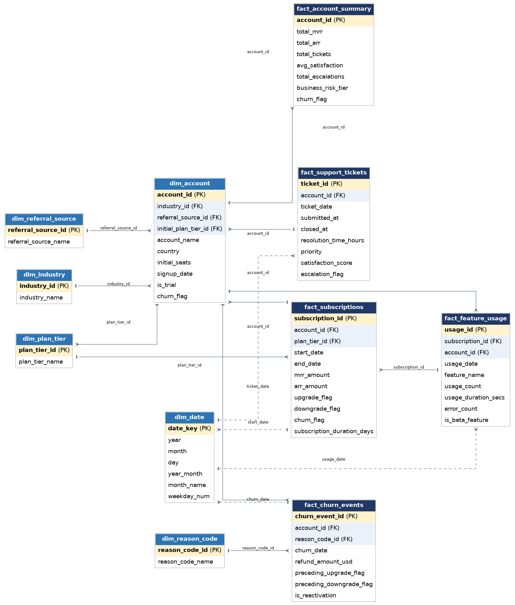
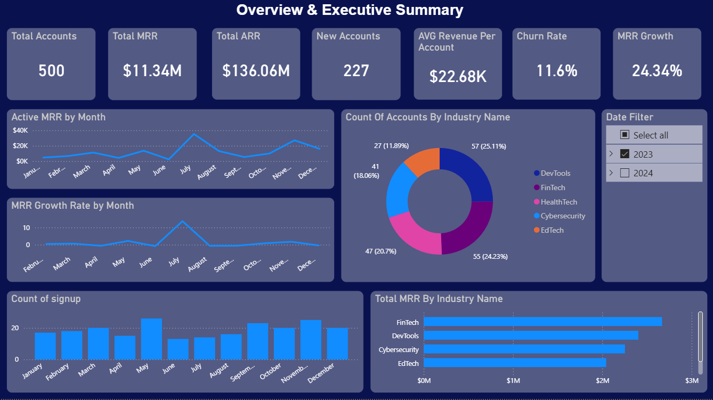
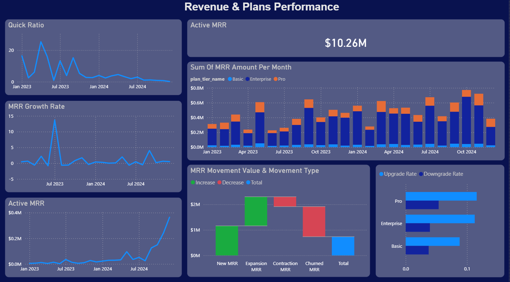
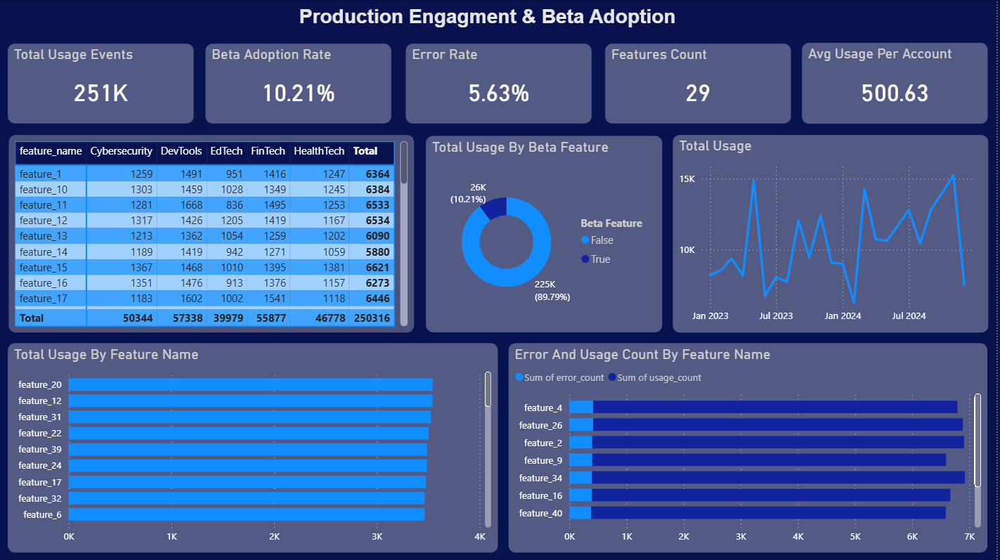
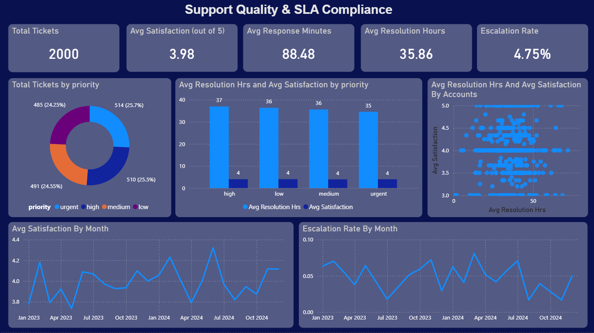
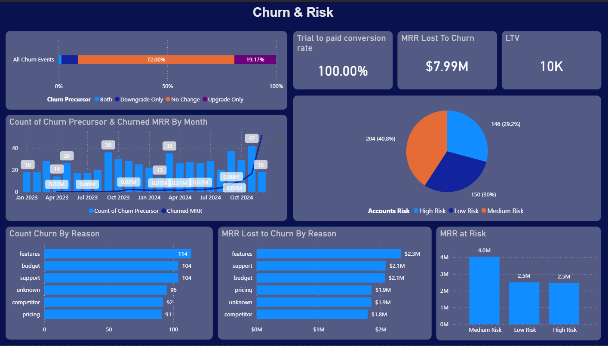

# RavenStack SaaS Analytics

End-to-end analytics project on a synthetic SaaS dataset: SQL Server data modeling (star schema) + Power BI dashboard covering revenue, product engagement, support quality, and churn diagnostics for a 500-account SaaS company.

---

## 📊 Project Overview

RavenStack is a fictional, stealth-mode SaaS startup. This project investigates what drives conversions, support load, and churn patterns across ~2 years of data (Jan 2023 – Dec 2024) using:

- **SQL Server** — data cleaning, star schema modeling, and KPI calculation
- **Power BI** — a 5-page interactive dashboard with 25+ DAX measures

The goal was to answer real business questions — revenue trends, product adoption, support quality, and churn drivers — using rigorous, verifiable analysis rather than assumptions.

## 📁 Dataset & Credit

This project uses the **RavenStack: Synthetic SaaS Dataset** (fully synthetic, no PII), covering 5 linked tables: `accounts`, `subscriptions`, `feature_usage`, `support_tickets`, `churn_events` (~32,500 total rows).

> **Dataset created by:** River @ Rivalytics ([blog](https://rivalytics.medium.com))
> Distributed under a permissive MIT-like license — used here for educational/portfolio purposes with credit to the original author.

## 🗂️ Repository Structure

```
ravenstack-analytics/
├── .gitignore
├── LICENSE
├── README.md
├── assets/
│   ├── erd_diagram.png
│   └── RavenStack_KPIs.png
├── sql/
│   ├── 00_setup_star_schema.sql
│   └── 01_saas_kpi_queries.sql
├── powerbi/
│   └── RavenStack_KPIs
└── reports/
    └── RavenStack_Executive_Report.docx

```

## 🏗️ Data Model

A **fact constellation (galaxy schema)**: one central `dim_account` and `dim_date`, four small lookup dimensions (`dim_industry`, `dim_plan_tier`, `dim_referral_source`, `dim_reason_code`), and five fact tables at their natural grain (subscriptions, feature usage, support tickets, churn events, and a pre-aggregated account summary).


## ⚙️ How to Reproduce

1. Create a SQL Server database and import the 5 source CSVs as raw tables (`accounts`, `subscriptions`, `feature_usage`, `support_tickets`, `churn_events`) via SSMS Import Wizard or `BULK INSERT`.
2. Run [`sql/00_setup_star_schema.sql`](sql/00_setup_star_schema.sql) — builds the full star schema, deduplicates known source data issues, and computes a data-driven customer risk tier. Safe to re-run.
3. (Optional) Run [`sql/01_saas_kpi_queries.sql`](sql/01_saas_kpi_queries.sql) to explore the 22 underlying analytical queries directly in SQL.
4. Open `powerbi/RavenStack_KPIs.pbix` in Power BI Desktop, point **Get Data → SQL Server** at your database, and refresh.

## 📄 Dashboard Pages

| Page | Focus |
|---|---|
| **Overview** | Total accounts, MRR/ARR, churn rate, ARPA, growth trend |

| **Revenue & Plans** | MRR movement (new/expansion/contraction/churned), Quick Ratio, GRR, upgrade/downgrade |

| **Product Engagement** | Feature adoption, beta usage, error rates |

| **Support Quality** | Ticket volume, resolution time, satisfaction, escalations |

| **Churn Diagnostics** | Churn reasons, MRR at risk, risk-tier distribution, LTV, conversion rate |


## 🔑 Key Findings

- Account-level behavioral signals (satisfaction, usage, escalations) **do not** meaningfully predict churn in this dataset — confirmed via direct SQL cohort comparison and a data-driven risk-tiering exercise.
- Churn rate varies meaningfully **by segment**: DevTools churns at ~31% vs. ~16% for Cybersecurity/EdTech; the "event" referral channel churns at 30% vs. 15% for "partner"-sourced accounts.
- "Features" and "Support" are the costliest churn reasons by lost MRR — not "Pricing," despite it being a common assumption.
- Growth efficiency (Quick Ratio) declined through late 2024, dropping below the healthy 1.0 threshold in several months.

Full analysis, caveats, and recommendations are in [`reports/RavenStack_Executive_Report.docx`](reports/RavenStack_Executive_Report.docx).

## ⚠️ Limitations

- Dataset is fully synthetic — findings reflect this dataset's generation logic, not universal SaaS truths.
- Expansion/Contraction MRR is approximated (no historical price-point log exists).
- CAC could not be calculated — no marketing/sales spend data in the schema.

## 🛠️ Tech Stack

`SQL Server` · `T-SQL` · `Power BI` · `DAX`

## 👤 Author

Built as a portfolio analytics project. Dataset credit: River @ Rivalytics.
